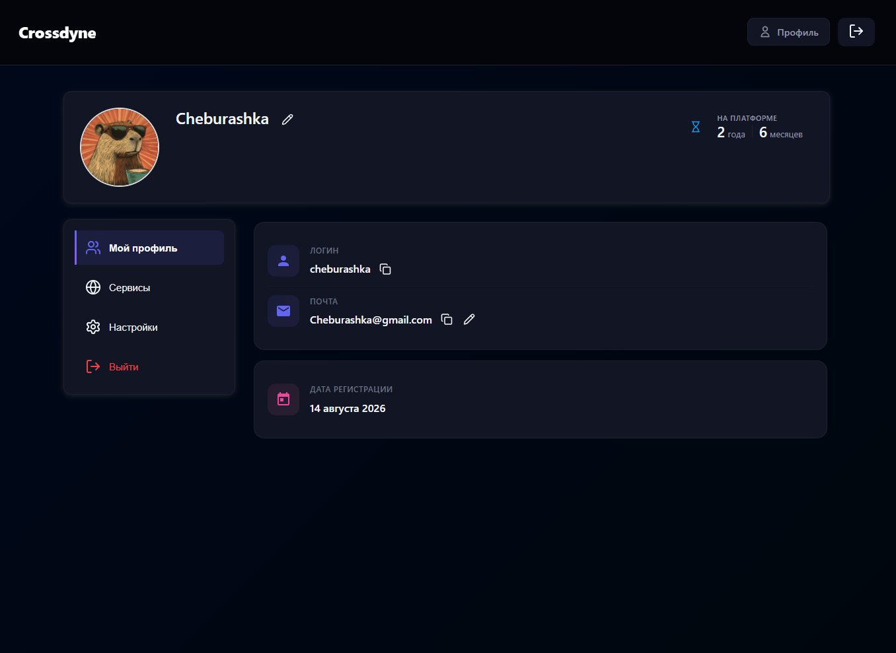
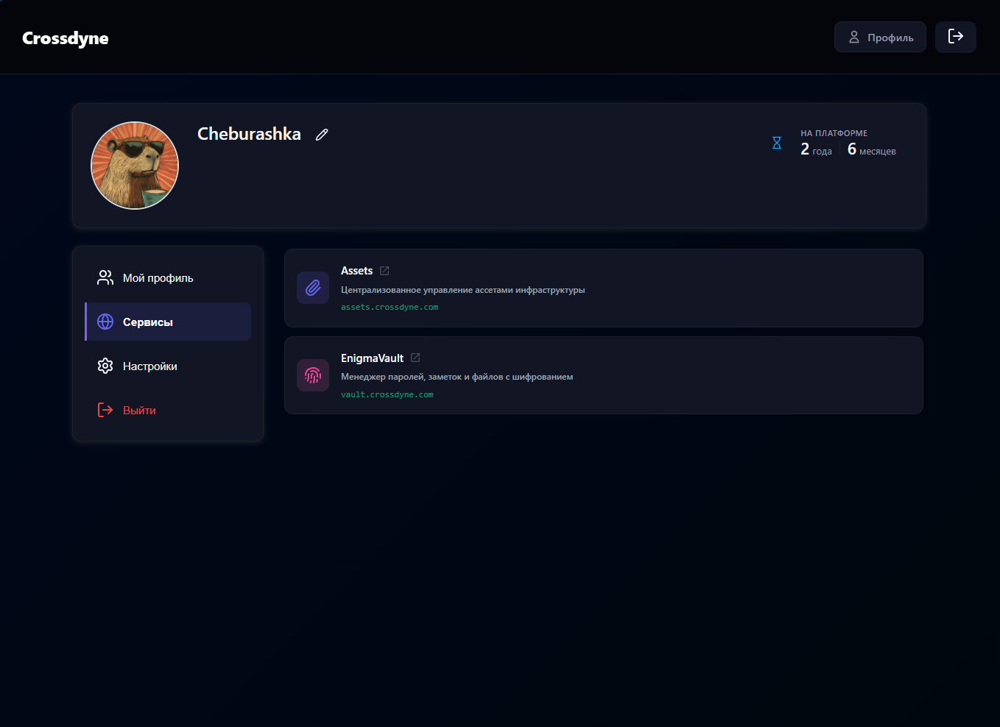
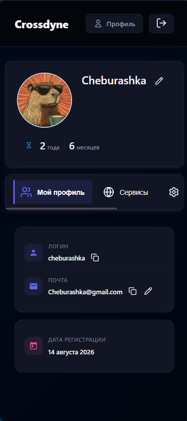

# 🔗 Nexus

> **Единая точка входа и централизованная система аутентификации для экосистемы Crossdyne**

Nexus — это SSO-платформа, обеспечивающая безопасный и seamless-доступ ко всем веб-сервисам экосистемы **Crossdyne**, размещённым на разных доменах в рамках `crossdyne.com`. Платформа выступает центральным хабом управления учётной записью пользователя, его профилем и доступом к сервисам.

---

## Скриншоты

### Десктопная версия — Профиль пользователя
Панель управления профилем с отображением логина, почты, даты регистрации и времени на платформе.

**

### Десктопная версия — Сервисы
Список доступных сервисов экосистемы с быстрыми ссылками и описанием каждого продукта.

**

### Мобильная версия
Полностью адаптированный интерфейс для смартфонов — все разделы доступны через компактное меню.

**

---

## Возможности

| Функция | Описание |
|---------|----------|
| 🔐 **Единый вход (SSO)** | Авторизация на всех сервисах экосистемы через одну учётную запись |
| 👤 **Управление профилем** | Изменение, адреса электронной почты и имени |
| 🔑 **Смена пароля** | Безопасное обновление и сброс пароля (через ключи восстановление и полноценный сброс с потерей зашифрованных данных) |
| 🌐 **Кроссдоменная сессия** | Автоматическая авторизация на всех поддоменах `*.crossdyne.com` |
| 📱 **Адаптивный UI** | Полная поддержка мобильных устройств и планшетов |
| ⚡ **Быстрый доступ к сервисам** | Централизованный каталог всех продуктов экосистемы |

---

## 🏗️ Архитектура

### Общая схема

```
┌─────────────────┐     ┌─────────────────┐     ┌─────────────────┐
│   Пользователь  │────▶│   Nexus (SSO)   │────▶│  Сервисы        │
│                 │     │  crossdyne.com  │     │  *.crossdyne.com│
└─────────────────┘     └────────┬────────┘     └─────────────────┘
                                 │
                    ┌────────────┴─────────────┐
                    │   Backend for Frontend   │
                    │      (Nexus.Bff)         │
                    │  • SRP-аутентификация    │
                    │  • Кроссдоменные cookies │
                    │  • Проксирование API     │
                    └──────────────────────────┘
```

### Компоненты Backend

| Сервис | Назначение |
|--------|-----------|
| `Nexus.Bff` | Backend for Frontend — прокси-слой между UI и сервисами, управление сессиями |
| `Authentication` | Сервис аутентификации на базе протокола **SRP** |
| `UserManagement` | Управление данными пользователя (профиль, почта, пароль) |

### Компоненты Frontend

- **Angular** — фреймворк для построения SPA
- **Тёмная тема**
- **Адаптивная вёрстка** — корректное отображение на любых устройствах

---

## Безопасность

### SRP — Secure Remote Password
Аутентификация реализована через протокол **SRP-6a**:
- Пароль **никогда не передаётся** по сети в открытом виде
- Вместо этого используется математическое доказательство владения паролем
- Защита от атак типа "человек посередине" и перебора по словарю

### Кроссдоменные сессии через BFF
- **Secure Session** cookies для распространения сессии между поддоменами
- **Backend for Frontend** токены и сессионные данные управляются на стороне сервера, а не в браузере
- Автоматический проброс сессии при переходе между сервисами экосистемы

---

## Структура проекта

```
nexus/
├── 📂 backend/                    # Backend-приложение (.NET)
│   ├── 📂 src/
│   │   ├── 📂 apps/
│   │   │   └── 📁 Nexus.Bff/      # BFF-прокси, точка входа для frontend
│   │   ├── 📂 services/
│   │   │   ├── 📁 Authentication/ # Сервис аутентификации (SRP)
│   │   │   └── 📁 UserManagement/ # Управление пользователями
│   │   └── 📂 shared/             # Общие библиотеки, утилиты
│   ├── 📂 tests/                  # Интеграционные и модульные тесты
│   ├── 📄 .dockerignore
│   ├── 📄 Directory.Packages.props
│   └── 📄 Nexus.sln
│
├── 📂 deployment/                 # Docker compose: build и deployment
│
└── 📂 web/                        # Frontend-приложение (Angular)
    └── 📂 nexus-ui/
        ├── 📂 src/                # Исходный код приложения
        ├── 📂 public/             # Статические ресурсы
        ├── 📂 dist/               # Сборка production
        ├── 📄 angular.json
        ├── 📄 Dockerfile
        ├── 📄 package.json
        └── 📄 tsconfig.json
```

---

## 🛠️ Технологический стек

### Backend
- **.NET 10** — основной фреймворк
- **SRP-6a** — протокол безопасной аутентификации
- **BFF Pattern** — Backend for Frontend
- **Redis** - распределенный кеш
- **Kafka** — event-driven архитектура

### Frontend
- **Angular 21** — фреймворк UI
- **TypeScript** — типизированный JavaScript
- **SCSS/CSS** — стилизация компонентов

### Инфраструктура
- **Docker** — контейнеризация сервисов
- **Nginx** — reverse proxy
- **RustFS** - S3 хранилище для файлов (аватары пользователей)


---

## 📋 Roadmap

### Первостепенные задачи

- **Административная панель** — управление пользователями, блокировка учётных записей, просмотр статистики `Admin`
- **Аудит входов и активности** — журнал авторизаций с IP, геолокацией, устройством и временем `Security`
- **Двухфакторная аутентификация (2FA)** — TOTP двухфакторная аутентификация `Security`
- **Управление активными сессиями** — просмотр всех сессий пользователя, отзыв доступа с отдельных устройств `Users`
- **Социальная часть (временно в SSO)** — поиск пользователей, публичные профили и система инвайтов. `Social`

### Без конкретных сроков

- **OAuth2 / OpenID Connect провайдер** — Nexus как identity-провайдер для сторонних приложений `Platform`
- **WebAuthn / Passkeys** — вход без пароля через биометрию или hardware-ключи `Security`
- **Уведомления о безопасности** — email-оповещения при входе с нового устройства или локации `Security`
- **Система достижений (концепт)** — геймификация активности в экосистеме Crossdyne: опыт за возраст аккаунта, выполнение заданий и т.д. На текущем этапе на стадии идеи, без конкретного плана реализации `Social`